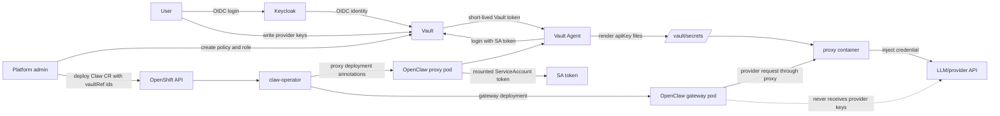

# Vault Decision Notes

This document explains what Vault adds to an OpenClaw-on-OpenShift deployment
and where it overlaps with the existing claw-operator proxy model.

## Summary

Vault is valuable when OpenClaw is offered as a shared or hosted service where
users should manage their own provider credentials without cluster-admin
touching Kubernetes Secrets. It gives us a separate human secret-management
plane, a workload identity model for the proxy, tenant-scoped Vault policies,
and Vault auditability.

Vault is probably not worth the extra operational complexity for a small
single-user install where an administrator is comfortable creating Kubernetes
Secrets directly and the existing proxy injection model is enough.

## What The Current Proxy Already Provides

The claw-operator proxy is already the key OpenClaw security boundary for
provider credentials:

- Provider credentials are injected by the proxy, not by the gateway.
- The gateway pod does not receive raw provider API keys.
- The Claw CR can reference credentials indirectly instead of embedding secret
  values.
- NetworkPolicy can force provider traffic through the proxy.
- The proxy centralizes credential injection for provider, channel, and MCP
  requests.

If the source of truth is Kubernetes SecretRefs, the proxy still protects
OpenClaw from directly seeing provider keys. That is already a strong baseline.

## What Vault Adds Over Kubernetes SecretRefs

Vault moves provider credential ownership and access control out of Kubernetes
Secrets and into a dedicated secret-management system.

| Area | Kubernetes SecretRefs | Vault-backed `vaultRef` |
| --- | --- | --- |
| Human secret management | Requires Kubernetes Secret access or an external workflow | Users log into Vault with OIDC and manage their own prefix |
| Workload identity | Proxy reads Kubernetes Secrets via operator-managed wiring | Vault Agent authenticates as the proxy pod ServiceAccount |
| Secret storage in cluster | Provider keys exist as Kubernetes Secret objects | Provider keys are rendered into pod memory-backed files by Vault Agent |
| Tenant scoping | Usually namespace and Secret RBAC | Vault policy can scope reads to `users/data/<tenant>/*` |
| Audit trail | Kubernetes API audit for Secret access | Vault audit can show human writes and workload reads |
| Rotation | Update Kubernetes Secret and restart/reconcile as needed | User updates Vault secret; proxy pod can be restarted to re-render |
| Operational cost | Lower | Higher: Vault, unseal, auth mounts, roles, policies, OIDC |

The strongest reason to use Vault is not that the proxy cannot protect secrets.
It can. The strongest reason is that Vault gives users a controlled place to
own, rotate, and audit credentials without making Kubernetes Secret management
part of the user workflow.

## What Vault Adds Over The Proxy Alone

Vault does not replace the proxy. It changes where the proxy gets credentials.

With Kubernetes SecretRefs:

```text
Kubernetes Secret -> claw-operator/proxy config -> proxy injects credential
```

With Vault:

```text
Vault KV -> Vault Agent sidecar -> /vault/secrets file -> proxy injects credential
```

The proxy still provides request-time credential injection and keeps the gateway
from seeing provider keys. Vault adds:

- a human UI/CLI for users to manage provider credentials;
- OIDC-based human login through Keycloak;
- per-tenant Vault policies independent of Kubernetes project RBAC;
- workload authentication through Kubernetes service account identity;
- a clearer separation between platform-admin duties and user secret rotation.

## Architecture



## Recommended Shape

Keep the operator integration intentionally narrow:

```yaml
spec:
  vault:
    authRole: team-a-openclaw
    kvMount: users
    kvVersion: 2
  credentials:
    - name: openrouter
      provider: openrouter
      vaultRef:
        - id: team-a/openrouter/apiKey
```

The operator should support only Vault Agent with Kubernetes auth. Other auth
modes belong in local or self-managed OpenClaw plugin workflows, not in the
hosted OpenShift operator path.

## When To Pursue Vault

Pursue Vault if the target deployment needs most of these:

- users self-manage provider keys;
- platform admins should not handle user API keys after onboarding;
- tenant-level secret boundaries should be expressed in Vault policy;
- secret access and rotation need a Vault audit trail;
- the deployment already operates Vault or is willing to operate it.

Stick with Kubernetes SecretRefs and the existing proxy if:

- the deployment is single-user or admin-managed;
- Kubernetes Secret creation is already automated elsewhere;
- Vault/Keycloak/unseal/policy operations would be more complexity than the
  deployment needs;
- the immediate goal is only to keep provider keys out of the gateway pod.

## Decision

Vault is a useful production/shared-cluster option, not a default requirement.
The proxy remains the core OpenClaw credential boundary. Vault is worth adding
when we want user-owned secret management, Vault policies, and Vault auditability
on top of the proxy.
